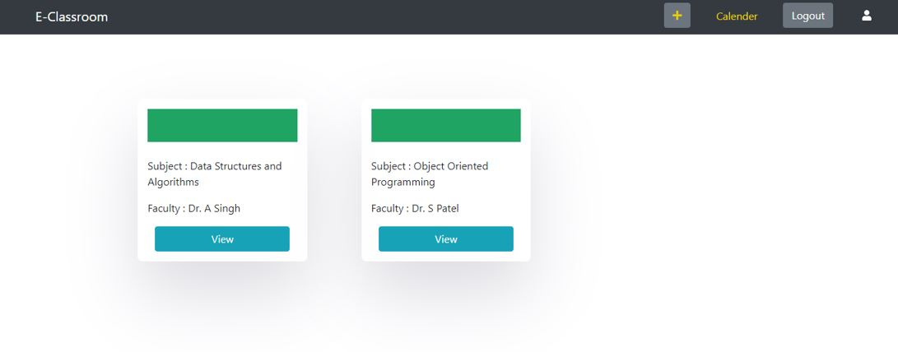
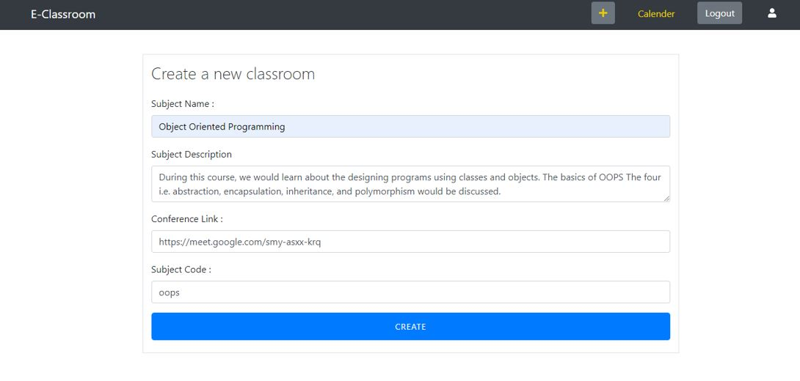
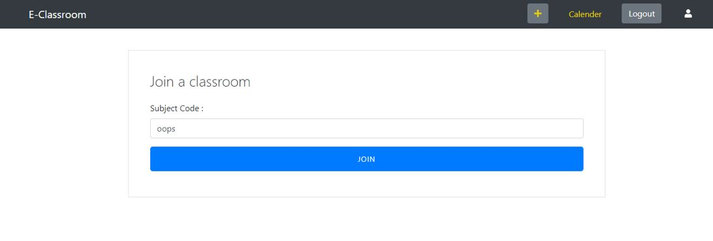
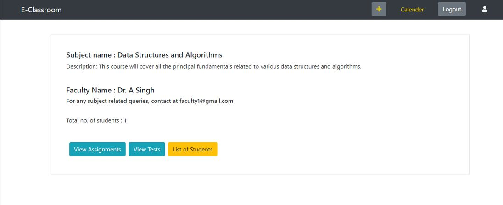
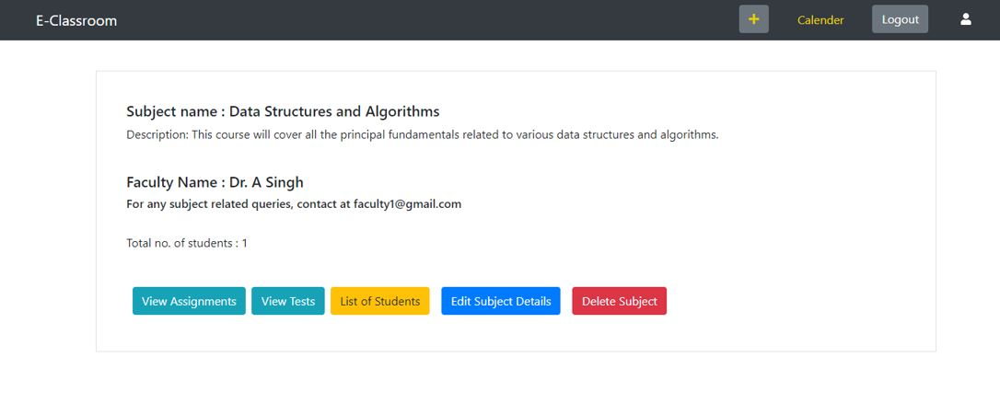

# E-Classroom Webapp
A web-application where teachers can take online classes for students. 

**Hosted on** : https://classroom-frontend.vercel.app/

## Features and Functionalities
- [x] Login and Signup pages for user authentication (both teachers and students)
- [x] Home page that shows the list of subjects for the logged in user
- [x] Create and Join Classroom functionality is provided as per user role 
- [x] Subject Page that contains all the information related to the classroom and other enrolled students
- [ ] Assignment Page that shows the list of assignments that are done and those that arer yet to be done
- [ ] Test Page showing the list of past test results and upcoming tests
- [ ] Calender showing the timetable for online lectures along with the links
- [ ] Video Conferencing feature 

*The features that are checked have been completed and deployed. Other features are in progress.*

## User Role
- **Teacher** : Has the right to create classes, upload assignments & tests, review tests and assign marks, and share video links for online lectures.
- **Student** : Has the right to join classes, perform assignments & tests and join the lectures. Would also be able to see the timetable and test results.

## Screens 

 
*
 Fig. 1: Signup Page 
*

*
 Fig. 2: Login Page 
*

*
 Fig. 3: Home Page 
*

*
 Fig. 4: Create Class for teacher 
*

*
 Fig. 5: Join Class for student 
*

*
 Fig. 6: Subject Dashboard (Teacher) 
*

*
 Fig. 7: Subject Dashboard (Student) 
*

## SetUp Instructions

**Prerequisites** - Install nodeJS, npm and MongoDB  

- Clone the repository
### For Backend
 - Go to Backend folder.
 - Run npm install
 - Set Up Environment variable in an .env file as shown in `env-sample` file.
 - Run `node ./server.js`
 
 *Note : For the MongoDB URI, you can run it locallly on `mongodb://localhost:27017`. Before running locally, run the command 'mongod' in terminal.*
 
### For Frontend
 - Go to Frontend folder.
 - Run `npm install`
 - Put backend url `localhost:4000` in src/config.js
 - Run `npm start`

## Built with
- Express.js - Backend web framework
- JSON Web Token - A standard to securely authenticate HTTP requests
- MongoDB - Database to store document-based data
- Mongoose - Object-modeling tool for Node.js
- Node.js - Runtime environment to help build fast server applications
- React - JavaScript library for building user interfaces
